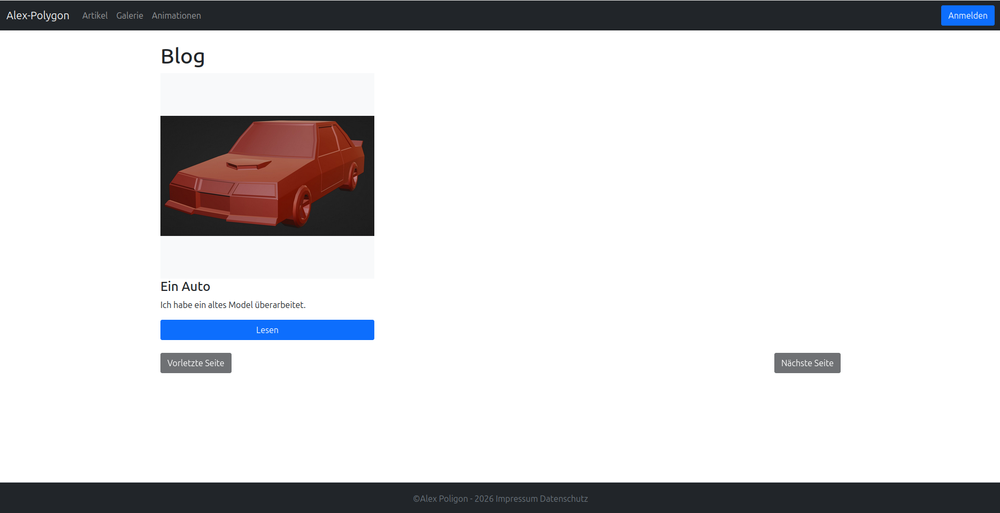

<h2>Journal</h2>

<h3>Description</h3>

    Ich habe diese Web-App entwickelt, um an einem zentralen Ort kurze Notizen zu erstellen,vollständige Artikel zu schreiben sowie meine 3D-Renderings und Animationen zu präsentieren. Zusätzlich habe ich dafür ein eigenes Micro-CMS entwickelt.

<h3>Features</h3>

<ul>
    <li>Artikel- und Notizverwaltung</li>
    <li>Bild-Upload</li>
    <li>Präsentation von 3D-Renderings und Animationen</li>
    <li>Micro-CMS</li>
</ul>

<h3>Tech Stack</h3>

<ul>
    <li>ASP.NET Core</li>
    <li>HTML5</li>
    <li>Bootstrap 5</li>
    <li>JavaScript</li>
</ul>
<h3>Screenshots</h3>
<ul>
    <li>
        <b>Hauptseite</b>
        

            
        

    </li>
    <li>
        <b>Galerie</b>
        

            
        

    </li>
    <li>
        <b>Bild-Upload</b>
        

            
        

    </li>
</ul>
